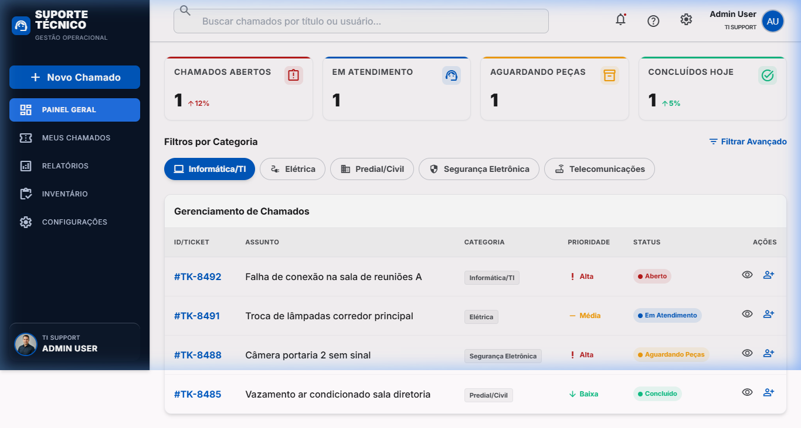

# 🛡️ Suporte Técnico Pro - Painel Operacional Premium

[](https://supabase.com)
[](https://vitejs.dev)
[](https://tailwindcss.com)
[](LICENSE)

Uma solução corporativa de alta performance para gestão de chamados e suporte técnico. Desenvolvida como uma **Single Page Application (SPA)** moderna, a plataforma oferece uma interface premium, intuitiva e totalmente integrada ao ecossistema **Supabase**.



## 💎 Diferenciais Estratégicos

Este projeto foi concebido sob a perspectiva de engenharia de software sênior, focando em:
- **Design System Atômico**: Utilização de tokens de design consistentes para cores, tipografia e espaçamento.
- **Segurança em Nível de Banco (RLS)**: Implementação de *Row Level Security* para garantir o isolamento total de dados entre clientes e técnicos.
- **Alta Performance**: Arquitetura Vanilla JS com Vite, garantindo tempos de carregamento ultra-rápidos e zero dependências pesadas de frameworks.
- **Experiência do Usuário (UX)**: Micro-interações, feedbacks visuais e layout adaptativo para dispositivos móveis.

---

## 🚀 Funcionalidades Principais

- **📊 Dashboard de Controle**: Visão geral de métricas operacionais com indicadores de tendência e status em tempo real.
- **🎫 Sistema de Chamados (Full CRUD)**: Gerenciamento completo de tickets com priorização (Alta, Média, Baixa) e categorização inteligente.
- **👤 Gestão de Perfis & Auth**: Controle de acesso baseado em funções (RBAC) integrado ao Supabase Auth.
- **📦 Inventário & Recursos**: Módulo para controle de ativos e equipamentos de suporte.
- **⚙️ Personalização Dinâmica**: Painel administrativo para alterar identidade visual (título, logo, cores) e informações de ajuda diretamente via UI.

---

## 🛠️ Stack Tecnológica

- **Core**: Vanilla JavaScript (ES6+), HTML5, CSS3.
- **Estilização**: Tailwind CSS com Design System personalizado.
- **Backend-as-a-Service**: [Supabase](https://supabase.com) (PostgreSQL, Auth, Storage, RLS).
- **Tooling**: [Vite](https://vitejs.dev) para bundling e hot-reload.
- **Ícones**: Material Symbols (Google Fonts).

---

## ⚙️ Guia de Instalação e Configuração

### Pré-requisitos
- [Node.js](https://nodejs.org/) (v16 ou superior)
- Conta no [Supabase](https://supabase.com/)

### Passo 1: Configuração do Backend (Supabase)
1. Crie um novo projeto no Supabase.
2. Acesse o **SQL Editor** e execute o script contido em `supabase/schema.sql` para estruturar o banco de dados.
3. Habilite o **Google Auth** ou **Email Auth** no painel de Autenticação, se desejar.

### Passo 2: Instalação Local
```bash
# Clone o repositório
git clone https://github.com/TFS-Data/suporte-tecnico.git

# Entre no diretório
cd suporte-tecnico

# Instale as dependências
npm install
```

### Passo 3: Variáveis de Ambiente
Crie um arquivo `.env` na raiz do projeto e preencha com as suas credenciais do painel do Supabase (Project Settings > API):
```env
VITE_SUPABASE_URL=https://seu-projeto.supabase.co
VITE_SUPABASE_ANON_KEY=sua-chave-anonima-aqui
```

### Passo 4: Execução
```bash
# Inicie o servidor de desenvolvimento
npm run dev
```


---

## 🔒 Arquitetura de Segurança (RLS)

O sistema implementa políticas de segurança rigorosas no PostgreSQL:
- **Profiles**: Usuários só podem ler e editar seus próprios dados de perfil.
- **Tickets**: Clientes veem apenas seus chamados; Técnicos e Admins possuem visão total.
- **System Settings**: Apenas usuários com a role `Administrador` podem salvar alterações globais.

---

## 📄 Licença
Este projeto está sob a licença MIT. Veja o arquivo [LICENSE](LICENSE) para mais detalhes.

---
*Desenvolvido por [TFS-Data](https://github.com/TFS-Data).*
